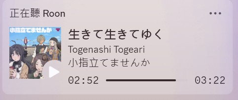
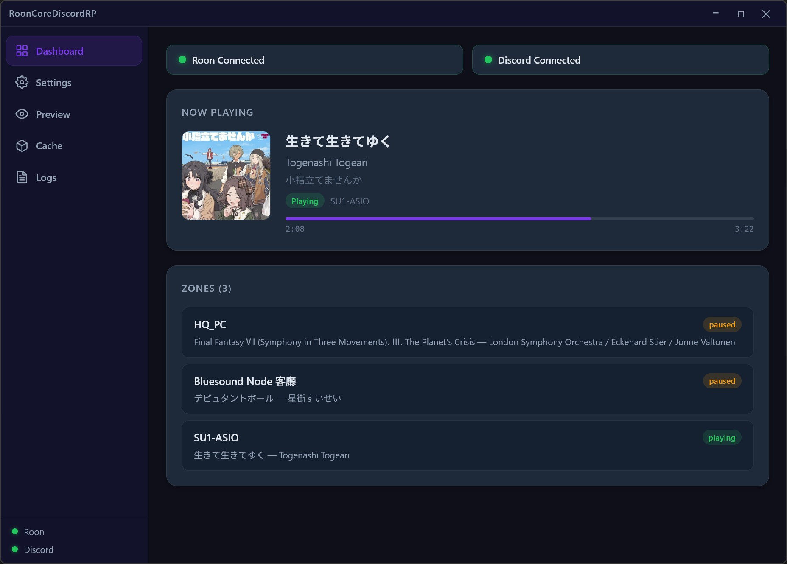
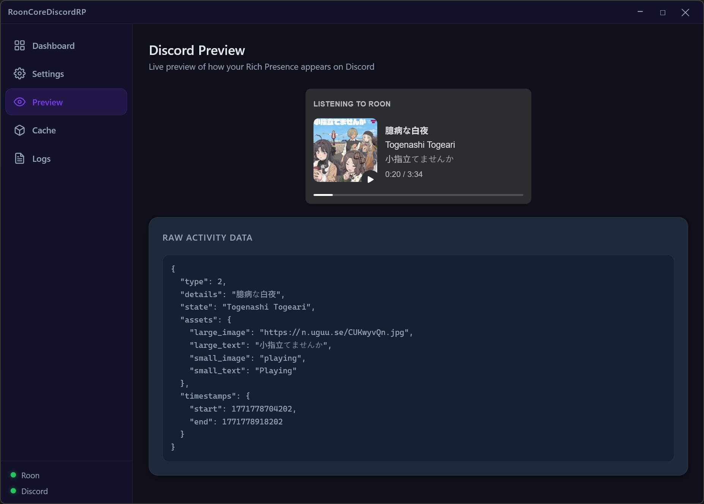
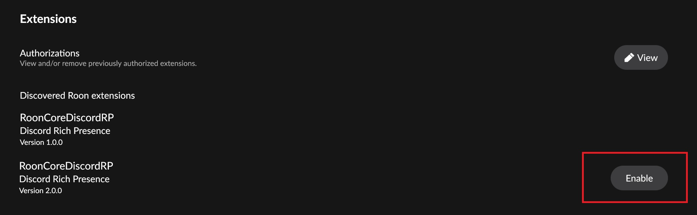

# RoonCoreDiscordRP

> Discord Rich Presence powered by Roon Core Extension API

**[🌐 繁體中文](README.zh-TW.md)**

Display your Roon playback status on Discord — including track name, artist, album, cover art, and a live progress bar. Unlike other solutions that rely on detecting a local Roon client, this project connects directly to Roon Core via the Extension API, so it works regardless of which zone or device is playing.

Includes both a **CLI mode** for headless/server use and an **Electron GUI** with dashboard, settings editor, Discord preview, image cache manager, and real-time log viewer.







## Features

- **Direct Roon Core connection** — queries the server, not a local client
- **Auto-discovery or manual IP** — works on the same network or across subnets
- **All zones monitored** — automatically tracks the most recently active zone
- **Cover art upload** — fetches album art from Roon and uploads to [Uguu](https://uguu.se) (primary) or [Catbox](https://catbox.moe) (fallback), free, no API key
- **Live progress bar** — shows elapsed/remaining time in Discord
- **Pause & stop handling** — updates status on pause, clears after configurable timeout
- **Seek detection** — progress bar updates when you skip forward/backward
- **Auto-reconnect** — recovers from both Roon Core and Discord disconnections
- **Lightweight** — no Discord library needed (raw IPC), no image processing library (Roon API handles resizing)
- **Electron GUI** — dashboard, settings editor, Discord preview, cache management, and log viewer
- **System tray** — minimize to tray for background operation

## Prerequisites

- **Node.js** 18+
- **Roon Core** running on your network
- **Discord** desktop app running on the same machine

## Installation

```bash
git clone https://github.com/TubeBoyJimmy/RoonCoreDiscordRP.git
cd RoonCoreDiscordRP
npm install
```

## Usage

### CLI Mode

```bash
npm start
```

On the first run, the app will guide you through setup:

1. Choose connection mode: **auto-discover** (same network) or **manual IP:port**
2. Authorize "Discord Rich Presence" in **Roon > Settings > Extensions**

   

3. Once connected, all available zones are listed and monitoring begins
4. Configuration is saved to `data/config.yaml`

### GUI Mode (Electron)

```bash
npm run gui
```

Opens a desktop window with:
- **Dashboard** — connection status, now playing card, zone list
- **Settings** — edit all configuration with immediate effect
- **Discord Preview** — live preview of how your Rich Presence appears
- **Image Cache** — manage cached cover art uploads
- **Logs** — real-time log viewer with level filtering

The app can minimize to system tray for background operation (prompted on first close, configurable in Settings).

A pre-configured Discord Application is included — no Developer Portal setup needed.

## Configuration

After the first run, you can edit `data/config.yaml`:

```yaml
roon:
  coreAddress: ''              # Leave empty for auto-discovery, or 'IP:port' for manual

display:
  showAlbum: true              # Show album name as large image tooltip
  showArtist: true             # Show artist name in activity state
  showCoverArt: true           # Upload and display cover art
  showProgress: true           # Show progress bar (timestamps)
  pauseTimeout: 30             # Seconds to wait before clearing activity on pause (0 = never)
  buttons: []                  # Custom buttons: [{label: "...", url: "..."}] (max 2)

discord:
  clientId: '...'              # Discord Application ID (pre-configured, no need to change)
  pipeNumber: 0                # IPC pipe number (0-9)

logging:
  debug: false                 # Enable verbose logging

gui:
  minimizeToTray: null         # null = prompt on first close, true = minimize, false = quit
```

## How It Works

```
Roon Core
  │  WebSocket (subscribe_zones)
  ▼
RoonService ─── zone state change events
  │
  │  now_playing + state
  ▼
buildActivity() ─── constructs Discord Activity
  │
  │  cover art needed?
  ▼
ImageUploader ─── cache lookup / upload via curl (Uguu → Catbox fallback)
  │
  │  Activity object (with public image URL)
  ▼
DiscordIpcService ─── IPC SET_ACTIVITY
  │
  ▼
Discord client updates Rich Presence
```

The app registers as a Roon Extension. Once authorized, it receives real-time push events for all zones via `subscribe_zones()`. Zone state changes trigger activity updates sent to Discord through the local IPC pipe.

Cover art is uploaded using the system's `curl` command to ensure reliable connectivity in both CLI and Electron environments.

## Multi-Zone Behavior

| Scenario | Behavior |
|----------|----------|
| Single zone playing | That zone is shown |
| Multiple zones playing | Most recently started zone wins |
| Active zone paused | Pause state shown, timeout timer starts |
| Active zone paused → another starts | New zone takes over ("last active wins") |
| All zones stopped | Activity cleared |
| Cold start with stale paused zones | Ignored until a zone starts playing |

## Custom Discord Application (Optional)

By default, the app uses a pre-configured Discord Application, and your Discord profile will show "Listening to **Roon**". If you want to customize the display name or icons:

1. Go to the [Discord Developer Portal](https://discord.com/developers/applications)
2. Click **New Application** — the name you choose will appear as "Listening to **YourName**"
3. Copy the **Application ID** and set it as `discord.clientId` in `data/config.yaml`
4. Optionally, go to **Rich Presence > Art Assets** and upload icons named `playing` and `paused` (512×512 PNG)

## Troubleshooting

| Problem | Solution |
|---------|----------|
| Extension not appearing in Roon | Ensure the app is running and on the same network as Roon Core. Try specifying `coreAddress` manually. |
| Discord status not updating | Make sure Discord desktop app is running. If using a custom `clientId`, verify it matches your Discord Application. |
| Cover art not showing | Image host may be temporarily unreachable. The activity will still show without an image. Enable `logging.debug: true` for details. |
| "Discord IPC handshake failed" | Discord may still be starting up. The app will auto-reconnect. |
| Progress bar not updating on seek | Seek detection uses a 5-second threshold. Very small seeks may not trigger an update. |
| GUI shows Electron network errors | Image uploads use system `curl` to bypass Electron network restrictions. Ensure `curl` is available (built-in on Windows 10/11). |

## Limitations

- **Roon Arc**: Playback via Roon Arc is not visible to the Extension API. This is a Roon platform limitation.
- **Discord desktop required**: Rich Presence uses local IPC, so the Discord desktop app must be running on the same machine.
- **Single activity**: Discord only supports one Rich Presence activity per user. The most recently active zone is shown.

## Project Structure

```
RoonCoreDiscordRP/
├── src/
│   ├── index.js        # CLI entry point, first-run setup
│   ├── app.js          # AppController — shared core logic (CLI + GUI)
│   ├── roon.js         # Roon Core connection & zone subscription
│   ├── discord.js      # Discord IPC (raw named pipe)
│   ├── activity.js     # Zone → Discord Activity builder
│   ├── images.js       # Image upload via curl (Uguu/Catbox) + caching
│   ├── config.js       # YAML config with defaults
│   ├── cache.js        # TTL-based key-value cache
│   ├── logger.js       # Timestamped logging with buffer
│   └── constants.js    # App constants
├── electron/
│   ├── main.js         # Electron main process
│   └── preload.js      # Context bridge (IPC)
├── gui/
│   ├── index.html      # Renderer entry
│   ├── renderer.jsx    # React root
│   ├── App.jsx         # Layout (sidebar + page routing)
│   ├── styles/
│   │   └── theme.css   # Dark theme, CSS variables
│   ├── components/
│   │   ├── Dashboard.jsx   # Connection status, now playing, zones
│   │   ├── Settings.jsx    # Config editor
│   │   ├── Preview.jsx     # Discord Rich Presence preview
│   │   ├── Cache.jsx       # Image cache management
│   │   ├── Logs.jsx        # Real-time log viewer
│   │   └── Sidebar.jsx     # Navigation
│   └── hooks/
│       └── useIpc.js   # IPC communication hooks
├── assets/             # SVG icons for Rich Presence
├── scripts/
│   └── launch-gui.js   # Electron launcher (clean env)
├── data/               # Runtime data (gitignored)
│   ├── config.yaml     # User configuration
│   └── cache.json      # Image URL cache
├── vite.config.js      # Vite bundler config (renderer)
└── package.json
```

## License

MIT
